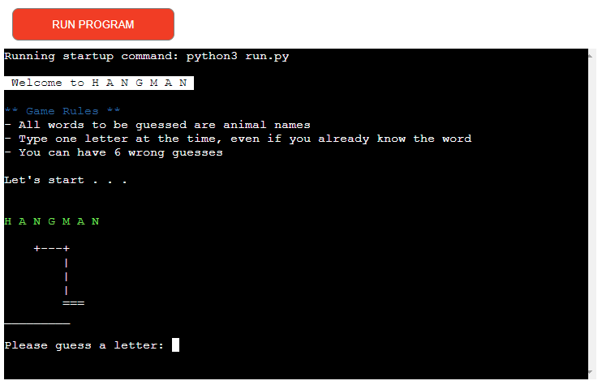
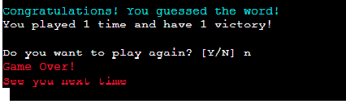

# HANGMAN
For my Milestone Project #3 on Code Institute's Diploma in Software Developement course I have created a Hangman Python game.
The game selects a random word from a list with 55 animal names and starts showing an empty hangman and blank spaces corresponding with each letter in the word that needs to be guessed. 
The game finishes when all the letters are guessed correctly or if the hangman is completed, leaving the user out of moves to play.

You can check the game clicking [HERE](https://ren-hangman.herokuapp.com/)

## Features
### Code features
- Created in Python using Visual studio Code.
- Deployed in Heroku for online interaction.
- Use of random library to select a random word from a list.
- Use of time library to add a short delay at the beginning of the game to present the game rules.
- Lines commented for an easy and clear code understanding.

### User features
- Before the game starts, user is presented with the game rules.
- Hangman is build as user makes wrong guesses.
- Console tells user if the guessed letter is right or wrong.
- List of all guessed letters is shown. 
- 
- If the user types something else than a letter, console shows an error message.
- If the user types the same letter again, console shows an error message.
- 
- The word to be guessed is shown as dashes so the user knows how many letters the word contains.
- At the end of the game, the user is asked if he wants to play again. If 'Y' is typed the game restarts. If 'N' is typed a goodbye message apears and the game finishes.
- 

## Technologies used
- [Python](https://www.python.org/)
- [Visual Studio Code](https://code.visualstudio.com/) as IDE
- [Git](https://git-scm.com/) for version control
- [GitHub](https://github.com/) to storage files 
- [Heroku](https://www.heroku.com/home) for deployment
- [PEP8](http://pep8online.com/) for code validation
## Resources
- [Code Institute](https://codeinstitute.net/) - course materials, Slack community and tutor support
- [Curso em Video](https://www.youtube.com/playlist?list=PLvE-ZAFRgX8hnECDn1v9HNTI71veL3oW0) - youtube programming channel
- [Invent with Python](https://inventwithpython.com/invent4thed/chapter8.html) - for inspiration
- [W3 Schools](https://www.w3schools.com/python/default.asp) - for material support

## Credits
### Content
- List of words contains only animals chosen randomly.

## Testing
Code passed with no errors on PEP8 Validator.
You can check it by clicking [HERE](http://pep8online.com/checkresult).

### Fixed Bugs
- Variables counter and times_win - when declared inside the function both were adding 1 only two times and then stopping the counting. I declared them outside the function and used them as global variables within the function and it makes them work properly, adding one at every victory and every time the game was played.
  
- Function keep_playing() - The input was initially with the 'while', with no variables declared to store it. The answer Y would restart the game, however any other letter typed would end it. I created the variable play_again and the if/else statements within the while loop so whatever the user types has a reaction.

- Line 150 - I add the input to ask the user Y/N (same as the one on line 142). By doing this, whenever the answer was Y the loop restarted and the question was repeted. The use of 'continue' avoided the duplicated questioning and restarted the game straight away.

#### ISSUE
*You may notice that this repository only contain a few commits. This was not intentional and happened just because the code was initially written in another repository. You can check it by clicking [HERE](https://github.com/rlorimier/hangman). When deploying the initial project on Heroku it was always returning failure messages.* 

*When contact CI Student Support I was told that was necessary to use the CI template due to important files to be added in order to make the deployment works. That said, a new repository was created. The previous code was copied and past on the new file and the deployment ran with no failure.*

## Creating a Repository and Deploying
- The steps to create a new repository:
  1) Logged in my GitHub page and accessed Code Institute GitHub page.
  2) Selected python-essencials-template and clicked in Use This Template.
  3) Created a new repository from the one mentioned above.
  4) On my GitHub Desktop, selected Add and then Clone a repository.
  5) On my Visual Studio Code (VSC), selected Open Folder and then selected the new created folder to start coding.

- The steps to commit and push commits:
  1) Every alteration on the files was being saved automatically.
  2) GitHub Desktop is connected with VSC and showns every changes made on the files.
  3) After every significant amount of coding is time for local commits:
     - On GitHub Desktop, type in a name for the commit and click Commit to Main.
  4) After a work day, the last local commit is done and then click in Push Origim to commit all local commits to GitHub repository.

- To Deploy:
  1) Logged in Heroku page and clicked New > Create New App.
  2) Selected app name and region.
  3) On Settings:
        - Created a Config Var called PORT and setted to 8000.
        - Added Python and NodeJS buildpacks.
  4) On Deploy:
        - Conected to my GitHub and searched a repository to conect with.
        - Clicked Deploy Branch 